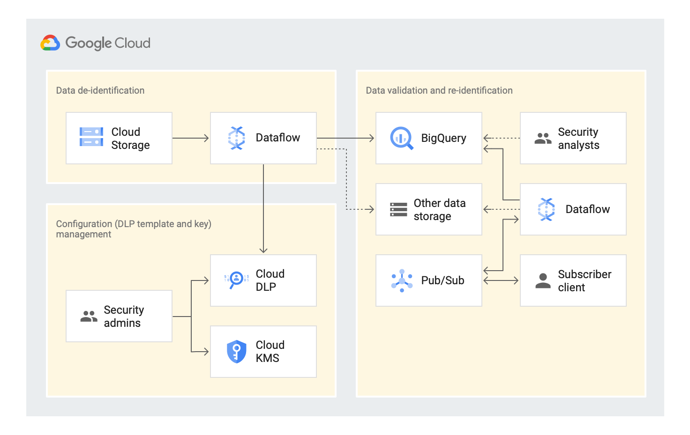

# Migrate Sensitive Data in BigQuery Using Dataflow & Cloud DLP  
 This repo contains a reference implementation of an end to end data tokenization solution designed to migrate sensitive data in BigQuery. Please check out the links below for reference guides: 

1. [Concept & Overview](https://cloud.google.com/solutions/de-identification-re-identification-pii-using-cloud-dlp).
2. [Create & Manage Cloud DLP Configurations](https://cloud.google.com/solutions/creating-cloud-dlp-de-identification-transformation-templates-pii-dataset).  
3. [Automated Dataflow Pipeline to De-identify PII Dataset](https://cloud.google.com/solutions/running-automated-dataflow-pipeline-de-identify-pii-dataset).   
4. [Validate Dataset in BigQuery and Re-identify using Dataflow](https://cloud.google.com/solutions/validating-de-identified-data-bigquery-re-identifying-pii-data).   

## Table of Contents  
* [Quick Start](#quick-start).  
	 
	* [Reference Architecture](#reference-architecture).  
	* [Quick Start- Setup Data Tokenization Demo](#quick-start).    	

* [Quick Start To S3 Inspection PoC](#quick-start-to-s3-inspection-poc).  
   

## Reference Architecture
	   	

## Quick Start
[](https://console.cloud.google.com/cloudshell/editor?cloudshell_git_repo=https://github.com/GoogleCloudPlatform/dlp-dataflow-deidentification.git)

  Run the following commands to trigger an automated deployment in your GCP project. Script handles following topics:   
 
 * Create a bucket ({project-id}-demo-data) in us-central1 and [uploads a sample dataset](https://cloud.google.com/solutions/creating-cloud-dlp-de-identification-transformation-templates-pii-dataset#downloading_the_sample_files) with <b>mock</b> PII data.  
 
 * Create a BigQuery dataset in US (demo_dataset) to store the tokenized data.  
 
 * Create a [KMS wrapped key(KEK)](https://cloud.google.com/solutions/creating-cloud-dlp-de-identification-transformation-templates-pii-dataset#creating_a_key_encryption_key_kek) by creating an automatic [TEK](https://cloud.google.com/solutions/de-identification-re-identification-pii-using-cloud-dlp#token_encryption_keys) (Token Encryption Key). 
  
 * Create DLP [inspect and re-identification template](https://cloud.google.com/solutions/creating-cloud-dlp-de-identification-transformation-templates-pii-dataset#creating_the_cloud_dlp_templates) with the KEK and crypto based transformations identified in this [section of the guide](https://cloud.google.com/solutions/de-identification-re-identification-pii-using-cloud-dlp#determining_transformation_type)
  
 * Trigger an [automated Dataflow pipeline](https://cloud.google.com/dataflow/docs/guides/templates/provided-streaming#data-maskingtokenization-using-cloud-dlp-from-cloud-storage-to-bigquery-stream) by passing all the required [parameters](https://cloud.google.com/solutions/running-automated-dataflow-pipeline-de-identify-pii-dataset#reviewing_the_pipeline_parameters) e.g: data, configuration & dataset name.  
 
 * Please allow 5-10 mins for the deployment to be completed.

```
gcloud config set project <project_id>
sh deploy-data-tokeninzation-solution.sh
```

 You can run some quick [validations](https://cloud.google.com/solutions/validating-de-identified-data-bigquery-re-identifying-pii-data#validating_the_de-identified_dataset_in_bigquery) in BigQuery table to check on tokenized data.  

For re-identification (getting back the original data in a Pub/Sub topic), please follow this instruction [here](https://cloud.google.com/solutions/validating-de-identified-data-bigquery-re-identifying-pii-data#re-identifying_the_dataset_from_bigquery).  

## Quick Start To S3 Inspection PoC
This is a hybrid solution for customers who would like to use Cloud DLP to scan PII data stored in a S3 bucket. Solution stores the inspection result in a BigQuery table. 

[](https://console.cloud.google.com/cloudshell/editor?cloudshell_git_repo=https://github.com/GoogleCloudPlatform/dlp-dataflow-deidentification.git)

* Note: Please modify the shell script below to update the required env variables before executing.    

```
gcloud config set project <project_id>
sh deploy-s3-inspect-solution.sh
```
## New S3 Scanner Build and Run
```
export AWS_ACCESS_KEY="<access_key>"
export AWS_SECRET_KEY="<secret_key>"
export AWS_CRED="{\"@type\":\"AWSStaticCredentialsProvider\",\"awsAccessKeyId\":\"${AWS_ACCESS_KEY_ID}\"
,\"awsSecretKey\":\"${AWS_SECRET_ACCESS_KEY}\"}"
```
```
gradle spotLessApply -DmainClass=com.google.solutions.s3.scanner.DLPS3ScannerPipeline 

gradle build -DmainClass=com.google.solutions.s3.scanner.DLPS3ScannerPipeline 

gradle run -DmainClass=com.google.swarm.tokenization.DLPS3ScannerPipeline -Pargs="--runner=DataflowRunner --project=<id> --autoscalingAlgorithm=NONE --workerMachineType=n1-standard-4 --numWorkers=5 --maxNumWorkers=5 --region=us-central1  --filePattern=gs://<bucket>/*.csv --inspectTemplateName=projects/<id>/inspectTemplates/inspect-test1 --tableSpec=project:demo_dataset.dlp_inspection_results --auditTableSpec=project:demo_dataset.dlp_inspection_audit --tempLocation=gs://dfs-temp-files/tmp  --batchSize=500000 --usePublicIps=false --diskSizeGb=500 --workerDiskType=compute.googleapis.com/projects/id/zones/us-central1-b/diskTypes/pd-ssd"

```
## To Do
- S3 Scanner accuracy. 
- Faul tolerant deployment scripts. 
