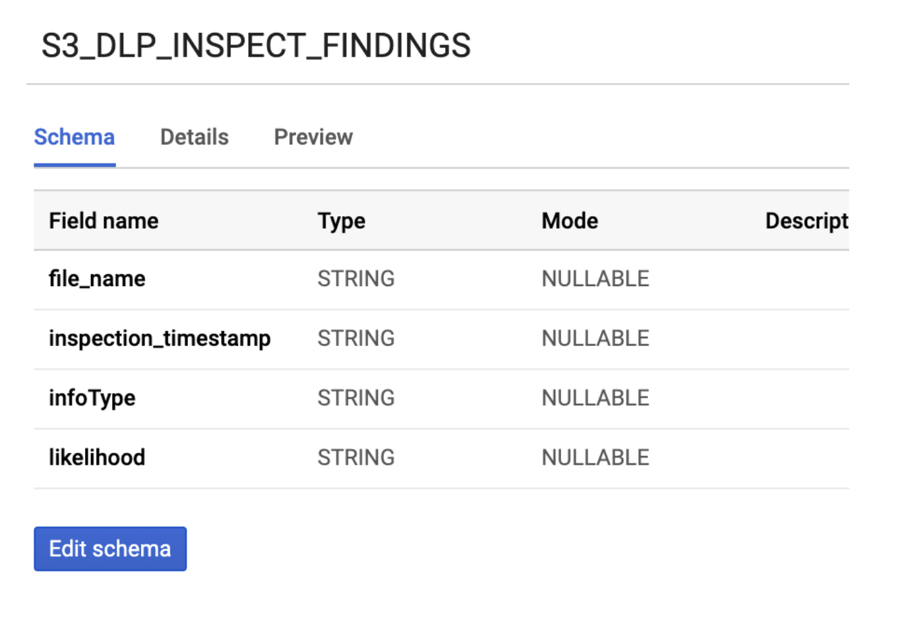
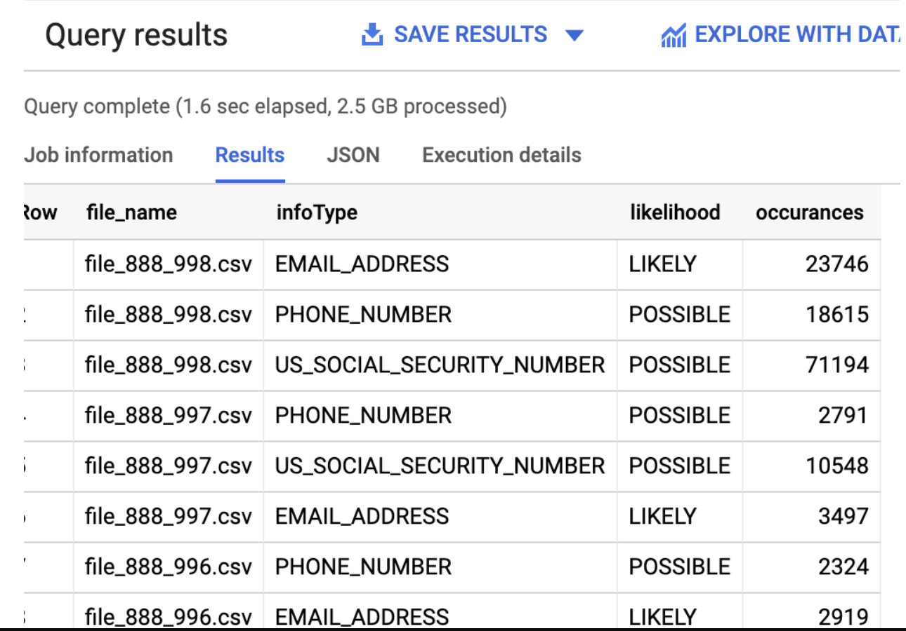
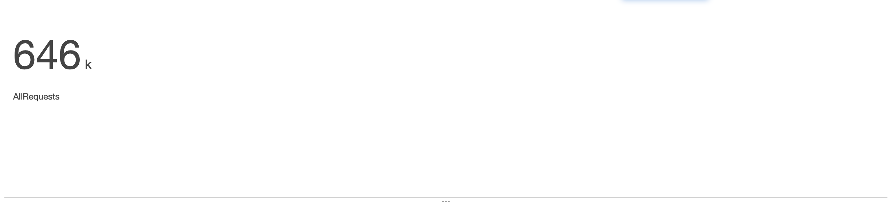

# Data Tokenization PoC Using Dataflow/Beam & DLP API  
Use case for fully structure data from GCS (CSV Files) to Big Query Dataset has been successfully migrated to standard dataflow template. You can use this template for data tokenization  with just few clicks. Please see the [code](https://github.com/GoogleCloudPlatform/DataflowTemplates/blob/master/src/main/java/com/google/cloud/teleport/templates/DLPTextToBigQueryStreaming.java) and [document](https://cloud.google.com/dataflow/docs/guides/templates/provided-templates#dlptexttobigquerystreaming).   


If your use case required encryption using customer supplied key (CSEK) and multiple sinks like GCS and BQ, then you can still use this repo going forward. 
There is also a new pipeline that supports import non structured data from AWS S3 bucket to GCS. Please see details below. 
This solution deidentify sensitive PII data by using data flow and DLP API. Solution reads an encrypted CSV or text file from GCS and output to GCS and Big Query Table.   
Some example use cases:  
Example:1 (Fully Structure using DLP Table Object)  
A CSV file containing columns like 'user_id' , 'password', 'account_number', 'credit_card_number' etc, this program can be used to deidentify all or subset of the columns.  
Example:2 (Semi Structured Data)  
A CSV file containing fields like 'comments' that may contain sensitive information like phone_number ("Please update my phone number to <num>") this program can be used to inspect and deidentify.  
Example:3 (Non Structured Data)  
A text file containing free text blobs (Chat logs for example) 

```
"hasellus sit amet erat. Nulla tempus. Vivamus in felis eu sapien cursus vestibulum.".LU42 577W U2SJ IRLZ RSOO.Decentralized didactic implementation.0604998391122913.Self-enabling.unleash distributed ROI Gonzalo Homer.802-19-8847."In hac habitasse platea dictumst. Etiam faucibus cursus urna. Ut tellus.".AZ28 RSAD QAWQ RMMQ TRDZ XXKW YJXQ.Advanced systematic time-frame 3542994965622197.Function-based.productize efficient networks Melodi Ferdinand.581-74-6338."Proin eu mi. Nulla ac enim. In tempor, turpis nec euismod scelerisque, quam turpis adipiscing lorem, vitae mattis nibh ligula nec sem."    
```
You can see there are some sensitive information in the blob. This program will inspect and deidentify for the all 4 info types in the example. This is useful for the use case where chat log or log files may contain sensitive information.        


Input file can use google managed key, customer supplied or customer managed encryption key. Please provide required arguments depends on the use case and encryption type.  

### Getting Started With Dataflow Template

Please read prerequisite section before execution.

Clone the repo locally.

For fully or semi structure data, a template can be created by 
```
gradle run -DmainClass=com.google.swarm.tokenization.CSVStreamingPipeline  -Pargs="--streaming --project=<project_id>--runner=DataflowRunner --templateLocation=gs://<bucket>/<object>
	 --gcpTempLocation=gs://<bucket>/<object>"
```
For non structure data, a template can be created by 
```
gradle run -DmainClass=com.google.swarm.tokenization.TextStreamingPipeline  -Pargs="--streaming --project=<project_id>--runner=DataflowRunner --templateLocation=gs://<bucket>/<object>
	 --gcpTempLocation=gs://<bucket>/<object>"
```
If the template is created successfully, you should see a "Template is created successfully" in the console log. 

```
Dataflow SDK version: 2.8.0
Jan 22, 2019 9:20:11 AM org.apache.beam.runners.dataflow.DataflowRunner run
INFO: Printed job specification to gs://df-template/dlp-tokenization
Jan 22, 2019 9:20:12 AM org.apache.beam.runners.dataflow.DataflowRunner run
INFO: Template successfully created.

```
Optionally, you can create a metadata file for the template:
There is a metadata file needs to be uploaded in the same location where the template is created. Please see the metadata file (dlp-tokenization-metadata) as part of repo.


To run the template from gcloud: 
(Alternatively you can also execute the template from Dataflow UI- Running Jobs from template- custom template-> Bucket location)

```
gcloud dataflow jobs run test-run-1 --gcs-location gs://df-template/dlp-tokenization --parameters inputFile=gs://<path>/.csv,project=<id>,batchSize=4700,deidentifyTemplateName=projects/<id>/deidentifyTemplates/8658110966372436613,outputFile=gs://<path>,outputFile=gs://output-tokenization-data/<folder_name>>,dataset=<dataset_name>, pollingInterval=10,numWorkers=5,maxNumWorkers=10,workerMachineType=n1-highmem-8

```
Note: if you are using customer supplied key for input file, please also pass optional arguments like csek, csekhash, fileDecryptKeyName, fileDecryptKey

### Local Build & Run

Clone the project 

Import as a gradle project in your IDE and execute gradle build or run. You can also use DirectRunner for small files.

Example 1: Full Structure data
```

gradle run -DmainClass=com.google.swarm.tokenization.CSVStreamingPipeline  -Pargs="--streaming --project=<id> --runner=DataflowRunner  --inputFile=gs://<bucket>/<object>.csv --batchSize=<n> --deidentifyTemplateName=projects/<id>/deidentifyTemplates/<id> --outputFile=gs://output-tokenization-data/output-structured-data --csek=CiQAbkxly/0bahEV7baFtLUmYF5pSx0+qdeleHOZmIPBVc7cnRISSQD7JBqXna11NmNa9NzAQuYBnUNnYZ81xAoUYtBFWqzHGklPMRlDgSxGxgzhqQB4zesAboXaHuTBEZM/4VD/C8HsicP6Boh6XXk= --csekhash=lzjD1iV85ZqaF/C+uGrVWsLq2bdN7nGIruTjT/mgNIE= --fileDecryptKeyName=gcs-bucket-encryption --fileDecryptKey=data-file-key --pollingInterval=10 --numWorkers=5 --workerMachineType=n1-highmem-2 --dataset=<dataset_id>

```

Example 2: Semi Structure Data

```
gradle run -DmainClass=com.google.swarm.tokenization.CSVStreamingPipeline  -Pargs="--streaming --project=<id> --runner=DataflowRunner  --inputFile=gs://<bucket>/<object>.csv --batchSize=<n> --deidentifyTemplateName=projects/<id>/deidentifyTemplates/<id> --outputFile=gs://output-tokenization-data/output-semi-structured-data --inspectTemplateName=--inspectTemplateName=projects/<id>/inspectTemplates/<id> --csek=CiQAbkxly/0bahEV7baFtLUmYF5pSx0+qdeleHOZmIPBVc7cnRISSQD7JBqXna11NmNa9NzAQuYBnUNnYZ81xAoUYtBFWqzHGklPMRlDgSxGxgzhqQB4zesAboXaHuTBEZM/4VD/C8HsicP6Boh6XXk= --csekhash=lzjD1iV85ZqaF/C+uGrVWsLq2bdN7nGIruTjT/mgNIE= --fileDecryptKeyName=gcs-bucket-encryption --fileDecryptKey=data-file-key --pollingInterval=10 --numWorkers=5 --workerMachineType=n1-highmem-2 --dataset=<dataset_id>

```

Example 3: Non Structured Data

```
gradle run -DmainClass=com.google.swarm.tokenization.TextStreamingPipeline  -Pargs="--streaming --project=<id> --runner=DataflowRunner  --inputFile=gs://<bucket>/<object>.csv --batchSize=<n> --deidentifyTemplateName=projects/<id>/deidentifyTemplates/<id> --outputFile=gs://output-tokenization-data/output-semi-structured-data --inspectTemplateName=projects/<id>/inspectTemplates/<id> --csek=CiQAbkxly/0bahEV7baFtLUmYF5pSx0+qdeleHOZmIPBVc7cnRISSQD7JBqXna11NmNa9NzAQuYBnUNnYZ81xAoUYtBFWqzHGklPMRlDgSxGxgzhqQB4zesAboXaHuTBEZM/4VD/C8HsicP6Boh6XXk= --csekhash=lzjD1iV85ZqaF/C+uGrVWsLq2bdN7nGIruTjT/mgNIE= --fileDecryptKeyName=gcs-bucket-encryption --fileDecryptKey=data-file-key --pollingInterval=10 --numWorkers=5 --workerMachineType=n1-highmem-2

```


### Prerequisites

#### Quickstart with Terraform
Assuming that you are gcloud authenticated - see [here](https://cloud.google.com/docs/authentication/production) and have enabled the following APIs- see [here](https://cloud.google.com/apis/docs/enable-disable-apis)
1. Cloud Key Management Service (KMS) API
2. Cloud Storage API 
3. DLP API

Download and install [Terraform](https://www.terraform.io/downloads.html). Go to `terraform_setup/main.tf` and fill in the variables under the local section. Terraform runs by using the service account credentials json set under the environmental variable `GOOGLE_APPLICATION_CREDENTIALS` (see [here](https://cloud.google.com/docs/authentication/production) for more details. Your service account should have the following roles:

- roles/iam.serviceAccountUser
- roles/storage.admin
- roles/bigquery.admin
- roles/cloudkms.admin
- roles/dlp.admin
- roles/cloudkms.cryptoKeyEncrypterDecrypter

This terraform script allows users to use their own pre-created KMS key ring/key/wrapped key by setting the variable `create_key_ring=false` or can also create all such resources for them by setting the variable `create_key_ring=true`. Run the terraform setup up by executing `terraform init` followed by `terraform apply`. This will set up all prerequisite GCP resources for this demo. 

#### Manual Setup 


There are quite a few tasks before you can run this successfully:


Create a GCP project and input output  GCS bucket  

```
After you are done, you should have the information available for the following args to be used from dataflow pipeline 
--inputFile=
--outputFile=
--project=
```

If you are using CSEK (Customer supplied encryption key), Please create a customer supplied encryption key and obtain KMS wrapped key for the encryption key. Also please read "How to Create KMS Wrapped Key" section
```
Instruction for creating a key can be found here:
https://cloud.google.com/storage/docs/encryption/using-customer-supplied-keys

Creating a Key rings and Key can be found here:
https://cloud.google.com/kms/docs/quickstart

At the end you should have a KMS wrapped key that can be used for dataflow pipeline for the argument --csek like below:  
--csek=CiQAbkxly/0bahEV7baFtLUmYF5pSx0+qdeleHOZmIPBVc7cnRISSQD7JBqXna11NmNa9NzAQuYBnUNnYZ81xAoUYtBFWqzHGklPMRlDgSxGxgzhqQB4zesAboXaHuTBEZM/4VD/C8HsicP6Boh6XXk=
```
Create a hash of the encryption key:

```
 openssl base64 -d <<< encryption_key | openssl dgst -sha256 -binary | openssl base64
 
 After you run this command above by replacing with your own encryptions key created in the previous step, you will have to use this in the dataflow pipeline argument like:
 --csekhash=lzjD1iV85ZqaF/C+uGrVWsLq2bdN7nGIruTjT/mgNIE=
```
Create DLP template using API explorer. Please look for DLP API how to guide. https://developers.google.com/apis-explorer/#p/dlp/v2/
Please note there is NO code change required to make this program run. You will have to create your CSV data file and DLP template and pass it on to dataflow pipeline. 

Create BQ dataset for tableSpec param. (Next release using Beam 2.9, this step will be automated. Currently this is on hold because of a known issue in beam 2.9 and File IO watch termination)
https://cloud.google.com/bigquery/docs/datasets

### How the Batch Size works?
DLP API has a limit for payload size of 524KB /api call. That's why dataflow process will need to chunk it.  User will have to decide on how they would like to batch the request depending on number of rows and how big each row is.

```
Batch Size by number of rows/ call

--batchSize=4700
--batchSize=500
```

If you notice resource exception error in the log, please reduce the number of workers passed as an argument. Example : --numWorkers=1 

### How the Dataflow pipeline works?

1. Dataflow pipeline continuously poll for new file based on the -pollingInterval argument and create a unbounded data set. For each file, it executes a pardo to split the file in chunks based on batch size provided (3 times the batch size). For example: a CSV file containing 100 rows will be split into three sub lists (45, 45 10) for batch Size =15. If customer supplied key is used, transformation process will try to decrypt the customer supplied encryption key by calling KMS API to decrypt the file and create a buffered reader for processing.

```

		PCollection<KV<String, List<String>>> filesAndContents = p
				.apply(FileIO.match().filepattern(options.getInputFile())
						.continuously(Duration.standardSeconds(options.getPollingInterval()), Watch.Growth.never()))
				.apply(FileIO.readMatches().withCompression(Compression.UNCOMPRESSED)).apply("FileHandler",
						ParDo.of(new CSVReader(options.getCsek(), options.getCsekhash(),
								options.getFileDecryptKeyName(), options.getFileDecryptKey(),
								options.as(GcpOptions.class).getProject(), options.getBatchSize())));

```

2. Next transformation will use Split DoFn based on each of sublist size and batch size provided. For example, list of 45 rows now further will be spilt into three lists each containing 15 elements. Split restriction will be like this: {[1,2],[2,3][3,4]}. This is how restrictions can call DLP API in parallel using split do FN. This only works for fully structured data. (CSVStreamingPipeline.java)
Please see this link below to understand how initial, split and new tracker restriction work for parallel processing. 
https://beam.apache.org/blog/2017/08/16/splittable-do-fn.html

```
@GetInitialRestriction
	public OffsetRange getInitialRestriction(KV<String, List<String>> contents) {

		this.numberOfRows = contents.getValue().size() - 1;
		int totalSplit = 0;
		totalSplit = this.numberOfRows / this.batchSize.get().intValue();
		int remaining = this.numberOfRows % this.batchSize.get().intValue();

		if (remaining > 0) {
			totalSplit = totalSplit + 2;

		} else {
			totalSplit = totalSplit + 1;
		}
		LOG.info("Initial Restriction range from 1 to: {}", totalSplit);
		return new OffsetRange(1, totalSplit);

	}

	@SplitRestriction
	public void splitRestriction(KV<String, List<String>> contents, OffsetRange range,
			OutputReceiver<OffsetRange> out) {
		for (final OffsetRange p : range.split(1, 1)) {
			out.output(p);

		}
	}

	@NewTracker
	public OffsetRangeTracker newTracker(OffsetRange range) {
		return new OffsetRangeTracker(new OffsetRange(range.getFrom(), range.getTo()));

	}

```

3. Next step is to create custom Row object from tokenized DLP table object and create a windowing for the given interval. By default it's 30 seconds.


```
PCollection<Row> dlpRows = dlpTables
				.apply("DoDLPTokenization",
						ParDo.of(new DLPTokenizationDoFn(options.as(GcpOptions.class).getProject(),
								options.getDeidentifyTemplateName(), options.getInspectTemplateName())))
				.apply(Window.<Row>into(FixedWindows.of(Duration.standardSeconds(options.getInterval())))
						.triggering(
								AfterProcessingTime.pastFirstElementInPane().plusDelayOf(Duration.standardMinutes(1)))
						.discardingFiredPanes().withAllowedLateness(Duration.standardMinutes(1)));


```


4. For each window, pipeline will use Big Query Dynamic Destination class to create a table for the given dataset and the project. 


```
dlpRows.apply("WriteToBQ",
				BigQueryIO.<Row>write().to(new BQDestination(options.getDataset(),
						options.as(GcpOptions.class).getProject()))
						.withFormatFunction(new BQTableRowSF())
						.withWriteDisposition(BigQueryIO.Write.WriteDisposition.WRITE_APPEND)
						.withCreateDisposition(BigQueryIO.Write.CreateDisposition.CREATE_IF_NEEDED));					

```

5. For each window, pipeline will use FileIO.writeDynamic() with FileIO Sink to create csv files in GCS location provided.


```

		dlpRows.apply(MapElements.via(new SimpleFunction<Row, KV<String, Row>>() {
			@Override
			public KV<String, Row> apply(Row row) {
				return KV.of(row.getTableId(), row);
			}
		})).apply(GroupByKey.<String, Row>create()).apply("WriteToGCS",
				FileIO.<String, KV<String, Iterable<Row>>>writeDynamic()
						.by((SerializableFunction<KV<String, Iterable<Row>>, String>) row -> {
							return row.getKey();
						}).via(new CSVSink()).to(options.getOutputFile()).withDestinationCoder(StringUtf8Coder.of())
						.withNumShards(1).withNaming(key -> FileIO.Write.defaultNaming(key, ".csv")));


```


### PoC Sample Architecture

 . 

 . 


### Known Issue

There is no known issue for Beam 2.11 that impacts this repo. 


### Has it been performance tested?

It has not been properly performance tested but has successfully processed 145 MB csv file with 1.5M rows less than a minute for a use case relate to credit card data for de-identification only. It uses 500 DLP API quotas/minute. Please know there is a soft limit for 600 for project but can be increased if required. Screenshot below shows the execution patterns. 

```
gradle run -DmainClass=com.google.swarm.tokenization.CSVStreamingPipeline -Pargs="--streaming --project=<id> --runner=DataflowRunner  --inputFile=gs://customer-encrypted-data/1500000CCRecords_1.csv --batchSize=3000 --deidentifyTemplateName=projects/<id>/deidentifyTemplates/31224989062215255  --outputFile=gs://output-tokenization-data/1500000_CC_Records --numWorkers=5 --workerMachineType=n1-highmem-8 --maxNumWorkers=10 --dataset=pii_dataset"

```
#### Processing 150M credit card records from a single CSV file to BigQuery

 

 

 

 

#### DLP APIs reaching default maximum quotas. Please reduce the number of workers if this happens. Next version, there will be an implementation of rate limiter.


### How to generate KMS wrapped key
By using KMS API and pass a encryption key, you can generate a KMS wrapped key.

```
 curl -s -X POST "https://cloudkms.googleapis.com/v1/projects/<id>/locations/global/keyRings/<key_ring_name>/cryptoKeys/<key_name>:encrypt"  -d "{\"plaintext\":\"<key>"}"  -H "Authorization:Bearer $(gcloud auth application-default print-access-token)"  -H "Content-Type:application/json"

```
Example KMS Wrapped key: 

```
"CiQAB3BWoa2D0UQTpmkE/u0sP5PRQBpQr8EoS4rc8b7EWKHReMcSQQAlBr7wi5erTwHkb+hhjrzC7o/uu0xCf8e7/bvUTaNkfIfh+rs9782nDwlrF9EyOhQlXIaNbRRIxroyKekQuES+"
```


### DLP template used in the use cases
##### Example 1: Fully Structured Data 

Sample input format in CSV:
UserId,Password,PhoneNumber,CreditCard,SIN,AccountNumber
dfellowes0@answers.com,dYmeZB,413-686-1509,374283210039640,878-44-9652,182001096-2
rkermath1@ox.ac.uk,OKJtHxB,859-180-4370,5038057247505321293,275-41-2120,793375128-8
snagle2@ftc.gov,VQsYF9Iv68,569-519-7788,3533613600755599,265-63-9123,644327532-2

DLP Deidentify Template Used:

```
{
 "name": "projects/{id}/deidentifyTemplates/8658110966372436613",
 "createTime": "2018-06-19T15:58:32.214456Z",
 "updateTime": "2018-06-19T15:58:32.214456Z",
 "deidentifyConfig": {
  "recordTransformations": {
   "fieldTransformations": [
    {
     "fields": [
      {
       "name": "SIN"
      },
      {
       "name": "AccountNumber"
      },
      {
       "name": "CreditCard"
      },
      {
       "name": "PhoneNumber"
      }
     ],
     "primitiveTransformation": {
      "cryptoReplaceFfxFpeConfig": {
       "cryptoKey": {
        "kmsWrapped": {
         "wrappedKey": "CiQAku+QvbDmstgYj4NEaoV6FGuB8l3jjWcUiyzJ+HR8NXYZSCASQQBdX/BxUhNiRixvCZnR5/zjFd8D0w9td1w6LUHccIb8HL0s+bK9iOzdllgcXRDC3X9tjx2oqI+S6lFd9tqE5ftd",
         "cryptoKeyName": "projects/{id}/locations/global/keyRings/customer-pii-data-ring/cryptoKeys/pii-data-key"
        }
       },
       "customAlphabet": "1234567890-"
      }
     }
    }
   ]
  }
 }
}
```
##### Example 2: Semi Structured Data 
Sample input format in CSV:
UserId,SIN,AccountNumber,Password,CreditCard,Comments
ofakeley0@elpais.com,607-82-9963,679647039-7,5433c541-a735-4783-ac1b-bdb1f95ba7b5,6706970503473868,Please change my number to. Thanks
cstubbington1@ibm.com,543-43-5623,466928803-2,b2892e74-9588-4c23-9645-ea4fdf4729e8,3549127839068106,Please change my number to 674-486-9054. Thanks
ekaman2@home.pl,231-68-8007,242426152-0,ce7e4400-92ea-4ba9-8758-5c6215b68b47,201665969359626,Please change my number to 430-349-3493. Thanks

DLP Deidentify Template Used:

```
{
 "name": "projects/{id}/deidentifyTemplates/6375801268847293878",
 "createTime": "2018-06-18T19:59:13.902712Z",
 "updateTime": "2018-06-19T12:25:03.554233Z",
 "deidentifyConfig": {
  "recordTransformations": {
   "fieldTransformations": [
    {
     "fields": [
      {
       "name": "SIN"
      },
      {
       "name": "AccountNumber"
      },
      {
       "name": "CreditCard"
      }
     ],
     "primitiveTransformation": {
      "cryptoReplaceFfxFpeConfig": {
       "cryptoKey": {
        "kmsWrapped": {
         "wrappedKey": "CiQAku+QvbDmstgYj4NEaoV6FGuB8l3jjWcUiyzJ+HR8NXYZSCASQQBdX/BxUhNiRixvCZnR5/zjFd8D0w9td1w6LUHccIb8HL0s+bK9iOzdllgcXRDC3X9tjx2oqI+S6lFd9tqE5ftd",
         "cryptoKeyName": "projects/{id}/locations/global/keyRings/customer-pii-data-ring/cryptoKeys/pii-data-key"
        }
       },
       "customAlphabet": "1234567890ABCDEF-"
      }
     }
    },
    {
     "fields": [
      {
       "name": "Comments"
      }
     ],
     "infoTypeTransformations": {
      "transformations": [
       {
        "infoTypes": [
         {
          "name": "PHONE_NUMBER"
         }
        ],
        "primitiveTransformation": {
         "cryptoReplaceFfxFpeConfig": {
          "cryptoKey": {
           "kmsWrapped": {
            "wrappedKey": "CiQAku+QvbDmstgYj4NEaoV6FGuB8l3jjWcUiyzJ+HR8NXYZSCASQQBdX/BxUhNiRixvCZnR5/zjFd8D0w9td1w6LUHccIb8HL0s+bK9iOzdllgcXRDC3X9tjx2oqI+S6lFd9tqE5ftd",
            "cryptoKeyName": "projects/{id}/locations/global/keyRings/customer-pii-data-ring/cryptoKeys/pii-data-key"
           }
          },
          "customAlphabet": "1234567890-",
          "surrogateInfoType": {
           "name": "[PHONE]"
          }
         }
        }
       }
      ]
     }
    }
   ]
  }
 }
}
 
```

DLP Inspect template:

```

{
 "name": "projects/{id}/inspectTemplates/7795191927316697091",
 "createTime": "2018-06-23T02:12:32.062789Z",
 "updateTime": "2018-06-23T02:12:32.062789Z",
 "inspectConfig": {
  "infoTypes": [
   {
    "name": "PHONE_NUMBER"
   }
  ],
  "minLikelihood": "POSSIBLE",
  "limits": {
  }
 }
}

```

##### Example 3: Non Structured Data 
Sed ante. Vivamus tortor. Duis mattis egestas metus.".SI84 7084 7501 2230 378.Operative dynamic frame.5602235457198185.non-volatile.innovate collaborative supply-chains
Selma Jade.407-24-8213."Morbi non lectus. Aliquam sit amet diam in magna bibendum imperdiet. Nullam orci pede, venenatis non, sodales sed, tincidunt eu, felis.".MD88 XCZD GPMR JX8X 8BN8 9RTA.Mandatory attitude-oriented migration.5285030805458686.function.harness 24/365 markets
Helga Lane.870-09-7239."Suspendisse potenti. In eleifend quam a odio. In hac habitasse platea dictumst.

DLP Deidentify Template Used:

```
{
 "name": "projects/{id}/deidentifyTemplates/2206100676278191052",
 "createTime": "2018-06-21T14:29:24.595407Z",
 "updateTime": "2018-06-21T14:29:24.595407Z",
 "deidentifyConfig": {
  "infoTypeTransformations": {
   "transformations": [
    {
     "primitiveTransformation": {
      "replaceWithInfoTypeConfig": {
      }
     }
    }
   ]
  }
 }
}
 
```

DLP Inspect template:

```

{
 "name": "projects/{id}/inspectTemplates/3113085388824253847",
 "createTime": "2018-06-21T14:32:49.905406Z",
 "updateTime": "2018-06-21T14:32:49.905406Z",
 "inspectConfig": {
  "infoTypes": [
   {
    "name": "CREDIT_CARD_NUMBER"
   },
   {
    "name": "PERSON_NAME"
   },
   {
    "name": "US_SOCIAL_SECURITY_NUMBER"
   },
   {
    "name": "IBAN_CODE"
   }
  ],
  "minLikelihood": "VERY_UNLIKELY",
  "limits": {
  }
 }
}

```

### DLP Inspection for Data Stored in AWS S3 Bucket

This PoC can be used to inspect large scale dataset (csv, txt) stored in AWS S3 bucket. It uses Dataflow S3 connector, invoke DLP Inspect API to inspect data based on some configuration specified in a DLP inspect template. It stores the result in BQ.   
### How it works?
1. Build and Run the pipline in a GCP project using Dataflow. Please ensure you have enabled DLP and DF apis before executing.
 
2. This PoC provides ability to scale horizontally (numofWorkers and numOfMaxWorkers) to meet large number of inspection requests in parallel. It uses Dataflow's streaming engine by default to process. 

4. Below gradle run command disable autoscaling e.g: --autoscalingAlgorithm=NONE for faster ramp up. Please notice both numWorkers and maxNumWorkers are set to same size. In order to avoid extremly first ramp up (False DDoS alert), please start with a lower number of workers and have auto scaling enabled.

### Before Start

1. Please ensure you have increased the quotas in GCP project. e.g: DLP, Number of Cores, In Use IPs, Storage. 
2. DLP Inspection Template created in the project. Template that was used for PoC is shared below. 
3. Understand the data processing requriement to tune the AWS client based on the gradle run mparams. e,g: maxNumberofConnnections, s3ThreadPool
4. Create a BQ dataset.

### Build and Run 

```
To Build :

gradle build -DmainClass=com.google.swarm.tokenization.S3Import --x test

To Run: 

gradle run -DmainClass=com.google.swarm.tokenization.S3Import -Pargs=" --streaming --project=<id> --runner=DataflowRunner --awsAccessKey=<key>--awsSecretKey=<key>--s3BucketUrl=s3://<bucket>/*.* --inspectTemplateName=projects/<id>/inspectTemplates/<template_id> --awsRegion=ca-central-1 --numWorkers=50 --workerMachineType=n1-highmem-16 --maxNumWorkers=50 --autoscalingAlgorithm=NONE --enableStreamingEngine --tempLocation=gs://<bucket>/temp --dataSetId=<dataset_id> --s3ThreadPoolSize=1000 --maxConnections=1000000 --socketTimeout=100 --connectionTimeout=100"

```
### Testing Configuration
This PoC was built to process large scale data by scaling number of workers horizontally. During our test run, we have successfully inspected 1.3 TB of data in less than 10 minutes. It's recommended to use n1-highmem-16 machines as it allows Dataflow to reserve more JVM heap memory.

TEST DATA SIZE:   1.3 TB  of CSV and text files.

1. Type 1: 50 n1-standard-16 machines. (800 vCPU, 2.93 TB memory)
2. Type 2: 50 n1-highmem-16 machines (800 vCPU, 5.08 TB memory)

Below configurations are common for both setup:

1. Unlimited DLP quotas
2. Use of Dataflow streaming engine 
3. Default (100k/sec) BigQuery streaming inserts. 


### Some Screenshots from the PoC run

#### S3 Bucket


#### Use of DLP Unlimited Quotas(Default is 600 calls /min) 


#### Inspection Result in BQ





#### AWS Request Count during the 10 mins Run


### DLP templates used

#### Inspect template:
```
inspectConfig": {
  "infoTypes": [
   {
    "name": "EMAIL_ADDRESS"
   },
   {
    "name": "CREDIT_CARD_NUMBER"
   },
   {
    "name": "US_SOCIAL_SECURITY_NUMBER"
   },
   {
    "name": "PHONE_NUMBER"
   },
   {
    "name": "IP_ADDRESS"
   }
  ],
  "minLikelihood": "POSSIBLE",
  "limits": {
  }
 }

```

### To Do
- Error handling in S3 import.
- Dynamic Dataflow template
- Unit Test and Code Coverage.
- Rate Limiter.


