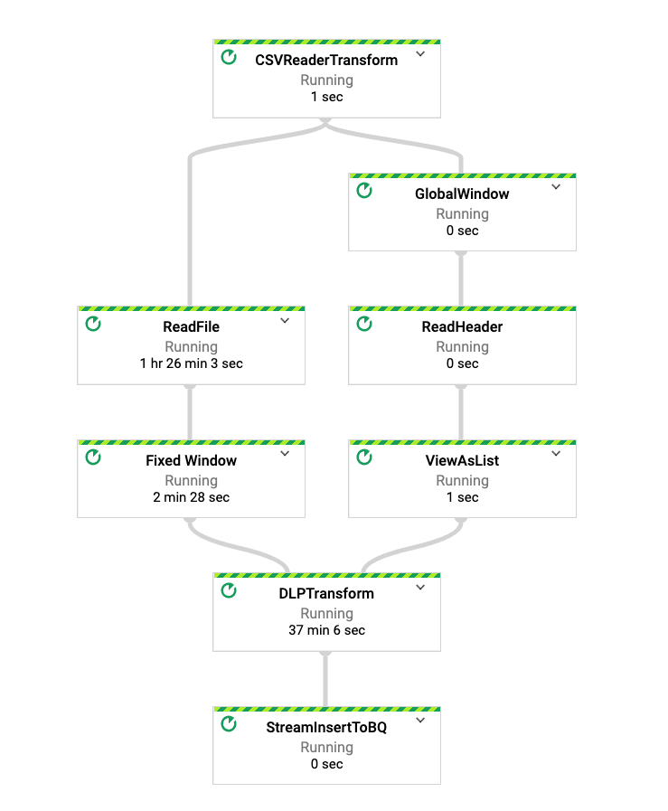

# Migrate Sensitive Data in BigQuery Using Dataflow & Cloud DLP  
 This repo contains a reference implementation of an end to end data tokenization solution designed to migrate sensitive data in BigQuery. Please check out the links below for reference guides: 

1. [Concept & Overview](https://cloud.google.com/solutions/de-identification-re-identification-pii-using-cloud-dlp).
2. [Create & Manage Cloud DLP Configurations](https://cloud.google.com/solutions/creating-cloud-dlp-de-identification-transformation-templates-pii-dataset).  
3. [Automated Dataflow Pipeline to De-identify PII Dataset](https://cloud.google.com/solutions/running-automated-dataflow-pipeline-de-identify-pii-dataset).   
4. [Validate Dataset in BigQuery and Re-identify using Dataflow](https://cloud.google.com/solutions/validating-de-identified-data-bigquery-re-identifying-pii-data).   

## Table of Contents  
* [Quick Start](#quick-start).  
	 
	* [Reference Architecture](#reference-architecture).  
	* [Quick Start- Setup Data Tokenization Demo](#quick-start).    	

* [V2 Solution By Using In Built Java Beam Transform](#v2-solution-by-using-in-built-java-beam-transform).  
   

## Reference Architecture
	   	

## Quick Start
[](https://console.cloud.google.com/cloudshell/editor?cloudshell_git_repo=https://github.com/GoogleCloudPlatform/dlp-dataflow-deidentification.git)

  Run the following commands to trigger an automated deployment in your GCP project. Script handles following topics:   
 
 * Create a bucket ({project-id}-demo-data) in us-central1 and [uploads a sample dataset](https://cloud.google.com/solutions/creating-cloud-dlp-de-identification-transformation-templates-pii-dataset#downloading_the_sample_files) with <b>mock</b> PII data.  
 
 * Create a BigQuery dataset in US (demo_dataset) to store the tokenized data.  
 
 * Create a [KMS wrapped key(KEK)](https://cloud.google.com/solutions/creating-cloud-dlp-de-identification-transformation-templates-pii-dataset#creating_a_key_encryption_key_kek) by creating an automatic [TEK](https://cloud.google.com/solutions/de-identification-re-identification-pii-using-cloud-dlp#token_encryption_keys) (Token Encryption Key). 
  
 * Create DLP [inspect and re-identification template](https://cloud.google.com/solutions/creating-cloud-dlp-de-identification-transformation-templates-pii-dataset#creating_the_cloud_dlp_templates) with the KEK and crypto based transformations identified in this [section of the guide](https://cloud.google.com/solutions/de-identification-re-identification-pii-using-cloud-dlp#determining_transformation_type)
  
 * Trigger an [automated Dataflow pipeline](https://cloud.google.com/dataflow/docs/guides/templates/provided-streaming#data-maskingtokenization-using-cloud-dlp-from-cloud-storage-to-bigquery-stream) by passing all the required [parameters](https://cloud.google.com/solutions/running-automated-dataflow-pipeline-de-identify-pii-dataset#reviewing_the_pipeline_parameters) e.g: data, configuration & dataset name.  
 
 * Please allow 5-10 mins for the deployment to be completed.

```
gcloud config set project <project_id>
sh deploy-data-tokeninzation-solution.sh
```

 You can run some quick [validations](https://cloud.google.com/solutions/validating-de-identified-data-bigquery-re-identifying-pii-data#validating_the_de-identified_dataset_in_bigquery) in BigQuery table to check on tokenized data.  

For re-identification (getting back the original data in a Pub/Sub topic), please follow this instruction [here](https://cloud.google.com/solutions/validating-de-identified-data-bigquery-re-identifying-pii-data#re-identifying_the_dataset_from_bigquery).  

## V2 Solution By Using In Built Java Beam Transform
This part of the repo provides a reference implementation to process large scale files for  any DLP transformation like Inspect, Deidentify or ReIdentify.  Solution can be used for CSV / Avro files stored in either GCS or AWS S3 bucket. It uses State and Timer API for efficient batching to process the files in optimal manner.  Please note parameters like --runMode=S3, DLPMethod=deid. Addition to these, you can also use --keyRange, --windowInterval, parameters to increase parallelism. 

## Build and Run
```
gradle spotlessApply

gradle build

gradle run -DmainClass=com.google.swarm.tokenization.DLPTextToBigQueryStreamingV2 -Pargs="--project=<projct_id> --streaming --enableStreamingEngine --tempLocation=gs://<bucket>/temp --numWorkers=1 --maxNumWorkers=2 --runner=DataflowRunner --CSVFilePattern=gs://<path>.csv --dataset=<name>   --inspectTemplateName=<inspect_template> --deidentifyTemplateName=<deid_tmplate> --DLPMethod=deid"
```
## S3 Scanner

```
export AWS_ACCESS_KEY="<access_key>"
export AWS_SECRET_KEY="<secret_key>"
export AWS_CRED="{\"@type\":\"AWSStaticCredentialsProvider\",\"awsAccessKeyId\":\"${AWS_ACCESS_KEY}\",\"awsSecretKey\":\"${AWS_SECRET_KEY}\"}"
```
```
gradle spotlessApply

gradle build

// inspect is default as DLP Method
gradle run -DmainClass=com.google.swarm.tokenization.DLPTextToBigQueryStreamingV2 -Pargs="--project=<project_id> --streaming --enableStreamingEngine --tempLocation=gs://<bucket>/temp --numWorkers=1 --maxNumWorkers=2 --runner=DataflowRunner --CSVFilePattern=s3://<bucket>>/file.csv --dataset=<name>  --inspectTemplateName=<inspect_template> --deidentifyTemplateName=<deid_tmplate>  --runMode=s3 --awsRegion=<aws_region> --awsCredentialsProvider=$AWS_CRED"
```
## Dataflow DAG
	   	

## Trigger Pipeline Using Public Image
You can use the gcloud command to trigger the pipeline using Dataflow flex template. Below is an example for de-identification transform from a S3 bucket.

```
gcloud beta dataflow flex-template run "dlp-s3-scanner-deid-demo" --project=<project_id> \
--region=<region> --template-file-gcs-location=gs://dataflow-dlp-solution-sample-data/dynamic_template_dlp_v2.json \
--parameters=^~^streaming=true~enableStreamingEngine=true~tempLocation=gs://<path>/temp~numWorkers=5~maxNumWorkers=5~runner=DataflowRunner~CSVFilePattern=<s3orgcspath>/filename.csv~dataset=<bq_dataset>~autoscalingAlgorithm=THROUGHPUT_BASED~workerMachineType=n1-highmem-8~inspectTemplateName=<inspect_template>~deidentifyTemplateName=<deid_template>~runMode=s3~awsRegion=ca-central-1~awsCredentialsProvider=$AWS_CRED~batchSize=100000~DLPMethod=deid

```
## To Do
- Integrate with Beam DLP Transform 
- Flex Template
