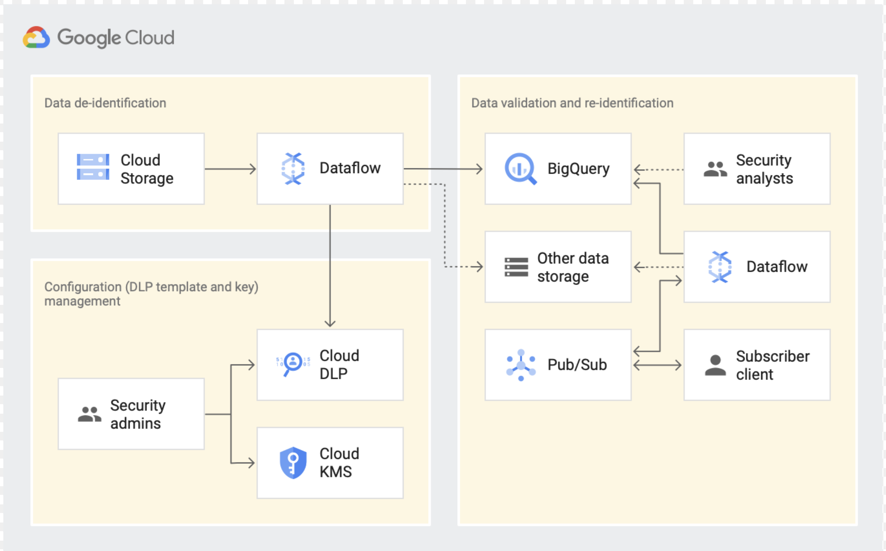

# Migrate Sensitive Data in BigQuery Using Dataflow & Cloud DLP  

## Table of Contents  
* [Deploy an end to end data tokenization Solution](#Quick Start To Deploy).  
	* [Concept & Overview](https://cloud.google.com/solutions/de-identification-re-identification-pii-using-cloud-dlp).   
	* [Reference Architecture](#reference architecture) 
	* [Create & Manage Cloud DLP Configurations](https://cloud.google.com/solutions/creating-cloud-dlp-de-identification-transformation-templates-pii-dataset).   
	* [Automated Dataflow Pipeline to De-identify PII Dataset](https://cloud.google.com/solutions/running-automated-dataflow-pipeline-de-identify-pii-dataset).   
	* [Validate Dataset in BigQuery and Re-identify using Dataflow](https://cloud.google.com/solutions/validating-de-identified-data-bigquery-re-identifying-pii-data).   
	* [Quick Start- Setup a Demo](#Quick Start To Deploy).    	

* [Data Inspection Solution from AWS S3 to BigQuery for Generic Dataset(CSV,Text)](#quickstart-inspection-demo).  
	* [Quickstart to setup a demo](#quickstart-s3-bq-demo).     

## Reference Architecture 
	   	

## Quick Start To Deploy
[](https://console.cloud.google.com/cloudshell/editor?cloudshell_git_repo=https://github.com/GoogleCloudPlatform/dlp-dataflow-deidentification.git)

```
gcloud config set project <project_id>
sh deploy-data-tokeninzation-solution.sh
```
## Quick Start To S3 Inspection Deploy

[](https://console.cloud.google.com/cloudshell/editor?cloudshell_git_repo=https://github.com/GoogleCloudPlatform/dlp-dataflow-deidentification.git)

```
gcloud config set project <project_id>
sh deploy-s3-inspect-solution.sh
```
