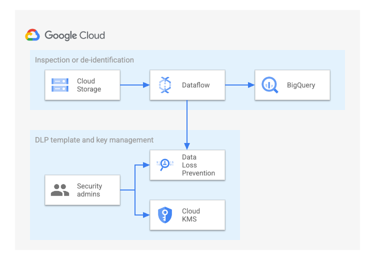
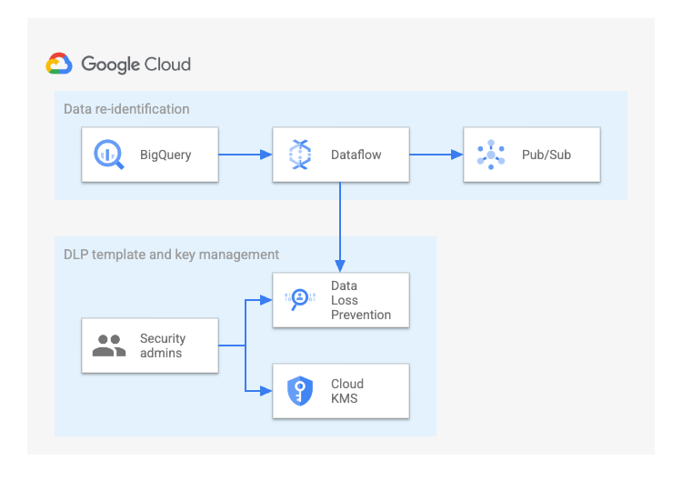
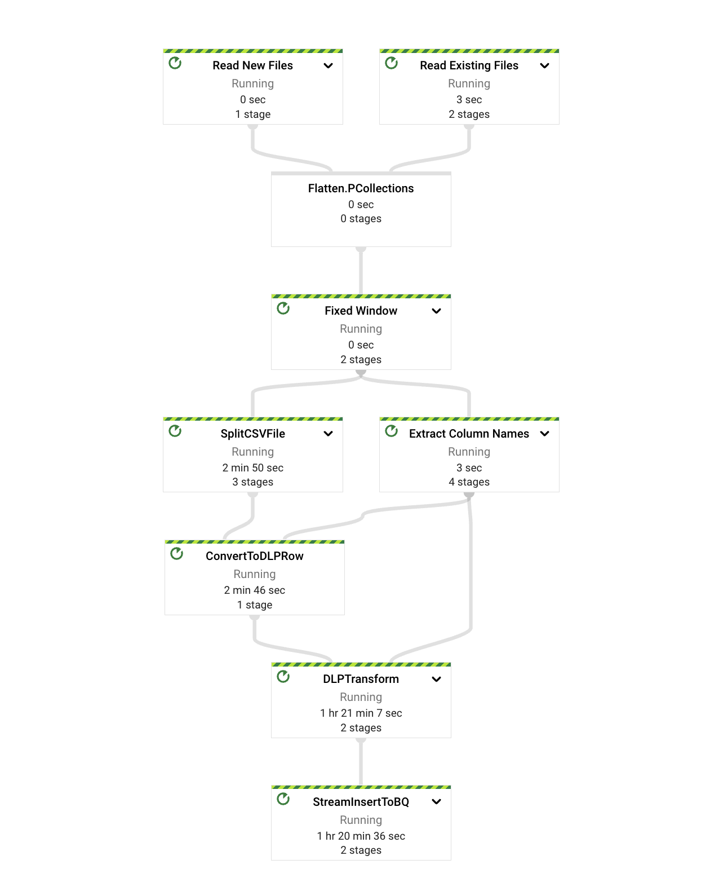

# Inspect, de-identify, and re-identify sensitive data using the Cloud DLP API and Dataflow
> This repo contains a reference implementation for an end-to-end data tokenization solution. This solution does the following:

* Passes data through Dataflow pipelines that perform inspection, de-identification, and re-identification through the Cloud Data Loss Prevention API (DLP API).
* Migrates the processed data to BigQuery.

 

## Table of Contents

* [Architecture](#architecture)

* [Concepts](#concepts)

* [Costs](#costs)

* [Tutorial](#tutorial)

    * [Prerequisites](#pre-requisites)
    * [Compile the code](#compile-the-code)
    * [Run the samples](#run-the-samples)
        * [Inspection](#inspection)
        * [De-identification](#de-identification)
        * [Validation](#validation)
        * [Re-identification](#re-identification-from-bigquery)
    * [Pipeline parameters](#pipeline-parameters)
    * [Supported file formats](#supported-file-formats)
    * [Amazon S3 scanner](#amazon-s3-scanner)
    * [GCS as sink for DEID](#gcs-as-sink-for-deid)

* [Adapt this pipeline for your use cases](#adapt-this-pipeline-for-your-use-cases)

* [Run this pipeline outside Cloud Shell](#run-this-pipeline-outside-cloud-shell)

* [Troubleshooting](#troubleshooting)

* [Dataflow DAG](#dataflow-dag)

* [Advanced topics](#advanced-topics)

* [Disclaimer](#disclaimer)


## Architecture
This solution comprises the following pipelines. To view the job graphs of these pipelines, see [Dataflow DAG](#dataflow-dag).
1. Inspection and de-identification
2. Re-identification

### Inspection and de-identification


You can use this pipeline for CSV, TSV, Avro, and JSONL files stored or ingested in Cloud Storage or an Amazon S3 bucket. This pipeline uses the State and Timer APIs to batch and process the files optimally.
The results of the inspection and de-identification processes are written in a BigQuery table.

### Re-identification


The re-identification pipeline is used to read data from a BigQuery table and publish the re-identified data to a secure Pub/Sub topic.

## Concepts

The following resources describe key concepts related to the DLP API and Dataflow. The DLP API is part of [Sensitive Data Protection](https://cloud.google.com/dlp/docs/sensitive-data-protection-overview).

1. [Using Sensitive Data Protection with BigQuery](https://cloud.google.com/dlp/docs/dlp-bigquery)
1. [De-identification and re-identification of PII in large-scale datasets using Sensitive Data Protection](https://cloud.google.com/solutions/de-identification-re-identification-pii-using-cloud-dlp)
1. [Sensitive Data Protection templates](https://cloud.google.com/dlp/docs/concepts-templates)
1. [Data masking/tokenization from Cloud Storage to BigQuery using a template](https://cloud.google.com/dataflow/docs/guides/templates/provided/dlp-text-to-bigquery)
1. [Inspect Google Cloud storage and databases for sensitive data](https://cloud.google.com/dlp/docs/inspecting-storage)
1. [Dataflow pipeline options](https://cloud.google.com/dataflow/docs/reference/pipeline-options)
1. [Sensitive Data Protection quotas and limits](https://cloud.google.com/dlp/limits)

## Costs

This tutorial uses billable components of Google Cloud, including the following:

* [Dataflow](https://cloud.google.com/dataflow/pricing)
* [Cloud Storage](https://cloud.google.com/storage/pricing)
* [Sensitive Data Protection](https://cloud.google.com/dlp/pricing)
* [Cloud Key Management Service](https://cloud.google.com/kms/pricing)
* [BigQuery](https://cloud.google.com/bigquery/pricing)
* [Pub/Sub](https://cloud.google.com/pubsub/pricing)

Use the [pricing calculator](https://cloud.google.com/products/calculator) to generate a cost estimate based on your
projected usage.

## Tutorial

### Prerequisites

1. [Create a Google Cloud project](https://console.cloud.google.com/projectselector2/home/dashboard).

2. Make sure that [billing is enabled](https://support.google.com/cloud/answer/6293499#enable-billing) for your Google
   Cloud project.

3. Use the link below to open Cloud Shell.

   [](https://console.cloud.google.com/cloudshell/editor?cloudshell_git_repo=https://github.com/GoogleCloudPlatform/dlp-dataflow-deidentification.git)

4. Run the following commands to set up the data tokenization solution in your Google Cloud project:

    ```
    gcloud config set project <project_id>
    sh setup-data-tokeninzation-solution-v2.sh
    ```

   The `setup-data-tokenization-solution-v2.sh` script performs the following tasks:

    * Creates a bucket ({project-id}-demo-data) in the us-central1 region and [uploads a sample dataset](http://storage.googleapis.com/dataflow-dlp-solution-sample-data/sample_data_scripts.tar.gz) with <b>mock</b> PII data.

    * Creates a BigQuery dataset (demo_dataset) in the US multi-region to store the tokenized data.

    * Creates a [KMS-wrapped key (KEK)](https://cloud.google.com/kms/docs/envelope-encryption) by creating an automatic [TEK](https://cloud.google.com/solutions/de-identification-re-identification-pii-using-cloud-dlp#token_encryption_keys) (token encryption key).

    * Creates [inspection, de-identification, and re-identification templates](https://cloud.google.com/solutions/creating-cloud-dlp-de-identification-transformation-templates-pii-dataset#creating_the_cloud_dlp_templates) with the KEK and [crypto-based transformations](https://cloud.google.com/dlp/docs/transformations-reference#crypto).

    * Creates a service account (with a custom role) for running the DLP API pipeline.

    * Enables Pub/Sub and creates a Pub/Sub topic that will be notified whenever a new file is added in the Cloud Storage bucket.

    * Emits a `set_env.sh` script, which you can use to set temporary environment variables while triggering the DLP API pipelines.

5. Run set_env.sh:

    ```
    source set_env.sh
    ```

### Compile the code

```
gradle build
```

### Run the samples

#### Inspection

You can run the inspection pipeline to do one or both of the following:

* Inspect only existing files in the Cloud Storage bucket.
* Inspect only new files added to the Cloud Storage bucket after the pipeline is triggered.

##### Inspect new and existing files

To trigger a streaming inspection Dataflow pipeline that processes all the CSV files in the `DATA_STORAGE_BUCKET` bucket (specified in the `filePattern` parameter), run the following command:

```
gradle run -DmainClass=com.google.swarm.tokenization.DLPTextToBigQueryStreamingV2 \
-Pargs=" --region=${REGION} \
--project=${PROJECT_ID} \
--streaming --enableStreamingEngine \
--tempLocation=gs://${DATA_STORAGE_BUCKET}/temp \
--numWorkers=1 --maxNumWorkers=2 \
--runner=DataflowRunner \
--filePattern=gs://${DATA_STORAGE_BUCKET}/*.csv \
--dataset=${BQ_DATASET_NAME}   \
--inspectTemplateName=${INSPECT_TEMPLATE_NAME} \
--deidentifyTemplateName=${DEID_TEMPLATE_NAME} \
--batchSize=200000 \
--DLPMethod=INSPECT \
--serviceAccount=${SERVICE_ACCOUNT_EMAIL} \
--gcsNotificationTopic=projects/${PROJECT_ID}/topics/${GCS_NOTIFICATION_TOPIC}"
```

##### Inspect only existing files

To trigger a batch inspection Dataflow pipeline that processes only the CSV files that are currently present in the `DATA_STORAGE_BUCKET` bucket (specified in the `filePattern` parameter), run the following command:

```
gradle run -DmainClass=com.google.swarm.tokenization.DLPTextToBigQueryStreamingV2 \
-Pargs=" --region=${REGION} \
--project=${PROJECT_ID} \
--tempLocation=gs://${DATA_STORAGE_BUCKET}/temp \
--numWorkers=1 --maxNumWorkers=2 \
--runner=DataflowRunner \
--filePattern=gs://${DATA_STORAGE_BUCKET}/*.csv \
--dataset=${BQ_DATASET_NAME}   \
--inspectTemplateName=${INSPECT_TEMPLATE_NAME} \
--deidentifyTemplateName=${DEID_TEMPLATE_NAME} \
--batchSize=200000 \
--DLPMethod=INSPECT \
--serviceAccount=${SERVICE_ACCOUNT_EMAIL}"
```

Any files that are added to the bucket after the pipeline was triggered are not inspected.

##### Inspect only new files

To trigger a streaming inspection Dataflow pipeline that processes new CSV files that are added to the `DATA_STORAGE_BUCKET` bucket (specified in the `filePattern` parameter), run the following command:

```
gradle run -DmainClass=com.google.swarm.tokenization.DLPTextToBigQueryStreamingV2 \
-Pargs=" --region=${REGION} \
--project=${PROJECT_ID} \
--streaming --enableStreamingEngine \
--tempLocation=gs://${DATA_STORAGE_BUCKET}/temp \
--numWorkers=1 --maxNumWorkers=2 \
--runner=DataflowRunner \
--filePattern=gs://${DATA_STORAGE_BUCKET}/*.csv \
--dataset=${BQ_DATASET_NAME}   \
--inspectTemplateName=${INSPECT_TEMPLATE_NAME} \
--deidentifyTemplateName=${DEID_TEMPLATE_NAME} \
--batchSize=200000 \
--DLPMethod=INSPECT \
--serviceAccount=${SERVICE_ACCOUNT_EMAIL} \
--gcsNotificationTopic=projects/${PROJECT_ID}/topics/${GCS_NOTIFICATION_TOPIC}
--processExistingFiles=false"
```

Any files that were added to the bucket before the pipeline was triggered are not inspected.

##### Inspection results

You can find the inspection results in the BigQuery dataset specified in the `dataset` parameter.

If `--processExistingFiles` is set to `false` and `--gcsNotificationTopic` is not provided, then the pipeline fails with an error similar to the following:

```
Exception in thread "main" java.lang.IllegalArgumentException: Either --processExistingFiles should be set to true or --gcsNotificationTopic should be provided
        at com.google.swarm.tokenization.DLPTextToBigQueryStreamingV2.runInspectAndDeidPipeline(DLPTextToBigQueryStreamingV2.java:113)
        at com.google.swarm.tokenization.DLPTextToBigQueryStreamingV2.run(DLPTextToBigQueryStreamingV2.java:93)
        at com.google.swarm.tokenization.DLPTextToBigQueryStreamingV2.main(DLPTextToBigQueryStreamingV2.java:84)
```

For information about the default values of the pipeline parameters, see [Pipeline parameters](#pipeline-parameters) on this page.

#### De-identification

You can run the de-identification pipeline to do one or both of the following:

* De-identify only existing files in the Cloud Storage bucket.
* De-identify only new files added to the Cloud Storage bucket after the pipeline is triggered.

##### De-identify new and existing files

To trigger a streaming de-identification Dataflow pipeline that processes all the CSV files in the `DATA_STORAGE_BUCKET` bucket (specified in the `filePattern` parameter), run the following command:

```
gradle run -DmainClass=com.google.swarm.tokenization.DLPTextToBigQueryStreamingV2 \
-Pargs=" --region=${REGION} \
--project=${PROJECT_ID} \
--streaming --enableStreamingEngine \
--tempLocation=gs://${DATA_STORAGE_BUCKET}/temp \
--numWorkers=2 --maxNumWorkers=3 \
--runner=DataflowRunner \
--filePattern=gs://${DATA_STORAGE_BUCKET}/*.csv \
--dataset=${BQ_DATASET_NAME}   \
--inspectTemplateName=${INSPECT_TEMPLATE_NAME} \
--deidentifyTemplateName=${DEID_TEMPLATE_NAME} \
--batchSize=200000 \
--DLPMethod=DEID \
--serviceAccount=${SERVICE_ACCOUNT_EMAIL} \
--gcsNotificationTopic=projects/${PROJECT_ID}/topics/${GCS_NOTIFICATION_TOPIC}"
```

##### De-identify only existing files

To trigger a batch de-identification Dataflow pipeline that processes only the CSV files that are currently present in the `DATA_STORAGE_BUCKET` bucket (specified in the `filePattern` parameter), run the following command:

```
gradle run -DmainClass=com.google.swarm.tokenization.DLPTextToBigQueryStreamingV2 \
-Pargs=" --region=${REGION} \
--project=${PROJECT_ID} \
--tempLocation=gs://${DATA_STORAGE_BUCKET}/temp \
--numWorkers=1 --maxNumWorkers=2 \
--runner=DataflowRunner \
--filePattern=gs://${DATA_STORAGE_BUCKET}/*.csv \
--dataset=${BQ_DATASET_NAME}   \
--inspectTemplateName=${INSPECT_TEMPLATE_NAME} \
--deidentifyTemplateName=${DEID_TEMPLATE_NAME} \
--batchSize=200000 \
--DLPMethod=DEID \
--serviceAccount=${SERVICE_ACCOUNT_EMAIL}"
```

Any files that are added to the bucket after the pipeline was triggered are not de-identified.

##### De-identify only new files

To trigger a streaming de-identification Dataflow pipeline that processes new CSV files that are added to the `DATA_STORAGE_BUCKET` bucket (specified in the `filePattern` parameter), run the following command:

```
gradle run -DmainClass=com.google.swarm.tokenization.DLPTextToBigQueryStreamingV2 \
-Pargs=" --region=${REGION} \
--project=${PROJECT_ID} \
--streaming --enableStreamingEngine \
--tempLocation=gs://${DATA_STORAGE_BUCKET}/temp \
--numWorkers=1 --maxNumWorkers=2 \
--runner=DataflowRunner \
--filePattern=gs://${DATA_STORAGE_BUCKET}/*.csv \
--dataset=${BQ_DATASET_NAME}   \
--inspectTemplateName=${INSPECT_TEMPLATE_NAME} \
--deidentifyTemplateName=${DEID_TEMPLATE_NAME} \
--batchSize=200000 \
--DLPMethod=INSPECT \
--serviceAccount=${SERVICE_ACCOUNT_EMAIL} \
--gcsNotificationTopic=projects/${PROJECT_ID}/topics/${GCS_NOTIFICATION_TOPIC} \
--processExistingFiles=false" 
```

Any files that were added to the bucket before the pipeline was triggered are not de-identified.

##### De-identification results

You can find the de-identification findings in the BigQuery dataset, specified in the `dataset` parameter, with the same names as the respective input files.

If `--processExistingFiles` is set to `false` and `--gcsNotificationTopic` is not provided, then the pipeline fails with an error similar to the following:

```
Exception in thread "main" java.lang.IllegalArgumentException: Either --processExistingFiles should be set to true or --gcsNotificationTopic should be provided
        at com.google.swarm.tokenization.DLPTextToBigQueryStreamingV2.runInspectAndDeidPipeline(DLPTextToBigQueryStreamingV2.java:113)
        at com.google.swarm.tokenization.DLPTextToBigQueryStreamingV2.run(DLPTextToBigQueryStreamingV2.java:93)
        at com.google.swarm.tokenization.DLPTextToBigQueryStreamingV2.main(DLPTextToBigQueryStreamingV2.java:84)
```

For information about the default values of the pipeline parameters, see [Pipeline parameters](#pipeline-parameters) on this page.

#### Validation

You can run some quick validations for a BigQuery table to check the tokenized data. The following steps use a sample dataset
to validate de-identified results:

1. In Cloud Shell, display the header row of the CSV file that you used to create the schema:

   ```commandline
   gsutil cp gs://${PROJECT_ID}-demo-data/CCRecords_1564602825.csv - | head -1
   ```

2. In the query editor of SQL workspace, run the following query to compare the schema with the header row of the CSV file:

   ```commandline
   SELECT table_name, column_name
   FROM `<dataset_id>.INFORMATION_SCHEMA.COLUMNS`
   WHERE table_name="CCRecords_1564602825"
   ```

   There are no spaces in the column names because the pipeline ensures that the column and table names only contain valid
   characters according to the BigQuery naming standard.

3. Validate that the number of rows in the input file and the output table are equal:

   Input records:
   ```commandline
   echo $(($(gcloud storage cat gs://${PROJECT_ID}-demo-data/CCRecords_1564602825.csv | wc -l) - 1))
   ```

   Output records:
   ```commandline
   SELECT COUNT(*) as number_of_rows
   FROM `<dataset_id>.CCRecords_1564602825` LIMIT 1
   ```

4. Validate that the bucketing transformation is successfully applied to the JobTitle column:

   ```commandline
   SELECT JobTitle, COUNT(*) AS number_of_records_found
   FROM `<dataset_id>.CCRecords_1564602825`
   GROUP BY JobTitle
   ```

   In the output, the JobTitle values should be grouped into three generalized buckets: Executive, Engineer, and Manager.


5. Validate that values in the Age column are grouped into six different buckets from 60 to 20:

   ```commandline
   SELECT Age, COUNT(*) AS number_of_records_found
   FROM `<dataset_id>.CCRecords_1564602825`
   GROUP BY Age
   ORDER BY Age DESC
   ```

6. Validate the masking transformation for the SSN:

   ```commandline
   SELECT SSN
   FROM `<dataset_id>.CCRecords_*`
   WHERE REGEXP_CONTAINS(SSN, "@*")
   ```

   In the output, the first five digits for all SSN entries should be masked.

7. Validate that the cryptographic transformation used deterministic encryption for the `card_holders_name`,
   `card_number` and `card_pin` entries:

   ```commandline
   SELECT Additional_Details
   FROM `<dataset_id>.CCRecords_*`
   WHERE REGEXP_CONTAINS(Additional_Details, r'(IBAN_CODE+)') or REGEXP_CONTAINS(Additional_Details, r'(EMAIL_ADDRESS+)')or regexp_contains(Additional_Details, r'(PHONE_NUMBER+)')or regexp_contains(Additional_Details, r'(ONLINE_USER_ID+)')
   ```

   In the output, sensitive values should be replaced with placeholder values such as `[IBAN_CODE]`, `[EMAIL_ADDRESS]`,
   `[PHONE_NUMBER,]` and `[ONLINE_USER_ID]`.

8. Query the de-identified copies of the dataset for the ID 76901:

   ```commandline
   SELECT * FROM `<dataset_id>.CCRecords_1564602825` WHERE ID='76901'
   ```

9. In Cloud Shell, compare the output from the previous step with the original dataset in the CSV file for the ID 76901:

   ```commandline
   gsutil cp gs://${PROJECT_ID}-demo-data/CCRecords_1564602825.csv - | awk -F "," '$1 == 76901'
   ```


#### Re-identification from BigQuery

1. Export a SQL query to read and re-identify data from BigQuery. The sample provided below selects 10 records that match the query.

   ```
   export QUERY="select ID,Card_Number,Card_Holders_Name from \`${PROJECT_ID}.${BQ_DATASET_NAME}.CCRecords_1564602828\` where safe_cast(Credit_Limit as int64)>100000 and safe_cast (Age as int64)>50 group by ID,Card_Number,Card_Holders_Name limit 10"
   ```

2. Create a Cloud Storage file with the following query:

   ```
   export REID_QUERY_BUCKET=<name>
   cat << EOF | gsutil cp - gs://${REID_QUERY_BUCKET}/reid_query.sql
   ${QUERY}
   EOF
   ```

3. Create a Pub/Sub topic. For more information, see [create a topic](https://cloud.google.com/pubsub/docs/create-topic#create_a_topic).

4. Run the pipeline by passing the required parameters:

   ```
   gradle run -DmainClass=com.google.swarm.tokenization.DLPTextToBigQueryStreamingV2 
   -Pargs="--region=${REGION} 
   --project=${PROJECT_ID} 
   --tempLocation=gs://${DATA_STORAGE_BUCKET}/temp 
   --numWorkers=1 --maxNumWorkers=2 
   --runner=DataflowRunner 
   --tableRef=${PROJECT_ID}:${BQ_DATASET_NAME}.<table> 
   --dataset=${BQ_DATASET_NAME} 
   --topic=projects/${PROJECT_ID}/topics/<topic_name> 
   --autoscalingAlgorithm=THROUGHPUT_BASED 
   --workerMachineType=n1-highmem-4 
   --deidentifyTemplateName=${REID_TEMPLATE_NAME} 
   --DLPMethod=REID 
   --keyRange=1024 
   --queryPath=gs://${REID_QUERY_BUCKET}/reid_query.sql 
   --serviceAccount=${SERVICE_ACCOUNT_EMAIL}"
   ```

   This command triggers a batch re-identification Dataflow pipeline that processes all the records from the query
   stored in `reid_query.sql`. The re-identified results can be found in the BigQuery
   dataset (`dataset` parameter) with the name of the input table as the suffix.


### Pipeline Parameters

| Pipeline Option                  | Description                                                                                                                                                                                                                                                        | Used in Operations  |
|----------------------------------|--------------------------------------------------------------------------------------------------------------------------------------------------------------------------------------------------------------------------------------------------------------------|---------------------|
| `region`                         | Specifies a regional endpoint for deploying your Dataflow jobs.                                                                                                                                                                                                    | All                 |
| `project`                        | The project ID for your Google Cloud project.                                                                                                                                                                                                                      | All                 |
| `streaming`                      | `true` if streaming pipeline.                                                                                                                                                                                                                                      | INSPECT/DEID        |
| `enableStreamingEngine`          | Specifies whether Dataflow Streaming Engine is enabled or disabled.                                                                                                                                                                                                | INSPECT/DEID        |
| `tempLocation`                   | Cloud Storage path for temporary files. Must be a valid Cloud Storage URL.                                                                                                                                                                                         | All                 |
| `numWorkers`                     | (Optional) The initial number of Compute Engine instances to use when executing your pipeline. This option determines how many workers the Dataflow service starts up when your job begins.                                                                        | All                 |
| `maxNumWorkers`                  | (Optional) The maximum number of Compute Engine instances to be made available to your pipeline during execution. This value can be higher than the initial number of workers (specified by numWorkers) to allow your job to scale up, automatically or otherwise. | All                 |
| `runner`                         | DataflowRunner                                                                                                                                                                                                                                                     | All                 |
| `inspectTemplateName`            | DLP API inspect template name.                                                                                                                                                                                                                                     | INSPECT/DEID        | 
| `filePattern`                    | The file pattern that will be used to scan the files to be processed by the job.                                                                                                                                                                                   | INSPECT/DEID        |
| `deidentifyTemplateName`         | DLP de-identify template name.                                                                                                                                                                                                                                     | All                 |
| `DLPMethod`                      | Type of DLP operation to perform. Valid values are `INSPECT`, `DEID`, or `REID`.                                                                                                                                                                                   | All                 |
| `processExistingFiles`           | Files existing in the Cloud Storage bucket before the pipeline is started will not be processed when the value is set to false. The default value is true.                                                                                                             | INSPECT/DEID        |
| `gcsNotificationTopic`           | Pub/Sub topic for notifications of new files added to the Cloud Storage bucket in filePattern. Format: projects/$PROJECT_ID>/topics/$GCS_TOPIC_NAME.                                                                                                               | INSPECT/DEID        |
| `batchSize`                      | (Optional) Batch size for the DLP API. The default is 500,000.                                                                                                                                                                                                         | All                 |
| `dataset`                        | BigQuery dataset to write the inspection or de-identification results to or to read from in case of re-identification.                                                                                                                                             | All                 |
| `recordDelimiter`                | (Optional) Record delimiter.                                                                                                                                                                                                                                       | INSPECT/DEID        |
| `columnDelimiter`                | Column delimiter. Only required in case of a custom delimiter.                                                                                                                                                                                                     | INSPECT/DEID        | 
| `tableRef`                       | BigQuery table to export from in the form `<project>:<dataset>.<table>`.                                                                                                                                                                                           | REID                |
| `queryPath`                      | Query file for re-identification.                                                                                                                                                                                                                                  | REID                |
| `headers`                        | DLP table headers. Required for the JSONL file type.                                                                                                                                                                                                               | INSPECT/DEID        |
| `numShardsPerDLPRequestBatching` | (Optional) Number of shards for DLP request batches. Can be used to control the parallelism of DLP requests. The default value is 100.                                                                                                                                     | All                 |
| `numberOfWorkerHarnessThreads`   | (Optional) The number of threads per each worker harness process.                                                                                                                                                                                                  | All                 |
| `dlpApiRetryCount`               | (Optional) Number of retries in case of transient errors in DLP API. The default value is 10.                                                                                                                                                                          | All                 |
| `initialBackoff`                 | (Optional) Initial backoff (in seconds) for retries with exponential backoff. The default is 5s.                                                                                                                                                                       | All                 |
| `outputBucket`                   | GCS path for storing the deidentified files                                                                                                                                                                       | DEID               |
| `DLPParent`                      | (Optional) The resource location for DLP templates. Format: `projects/<project-id>/locations/<region>`. By default,the location will be global.                                                                                                                    | ALL                |

For more details, see [Dataflow Pipeline Options](https://cloud.google.com/dataflow/docs/reference/pipeline-options).

### Supported file formats

#### 1. CSV

For sample commands for processing CSV files, see [Run the samples](#run-the-samples).

#### 2. TSV

The pipeline supports the TSV file format which uses tabs as column delimiters. The pipeline options are similar to that of CSV files. The extension of the file name should be .tsv.

```
gradle run ... -Pargs="... --filePattern=gs://<bucket_name>/small_file.tsv"

```

#### 3. JSONL

The pipeline supports JSONL file format where each line is a valid JSON object and newline characters separate JSON objects. For a sample file, see the [test resources](src/test/resources/CCRecords_sample.jsonl).
To run the pipeline for JSONL files, the list of comma-separated headers also needs to be passed in the pipeline options.

```
gradle run ... -Pargs="... --filePattern=gs://${PROJECT_ID}-demo-data/CCRecords_sample.jsonl --headers=<comma_separated_list_of_headers>"
```

#### 4. Avro

The pipeline handles Avro files similarly to how it handles CSV files. No additional changes are required to run
the pipeline except updating the `--filePattern` parameter. For example:

```commandline
gradle run ... -Pargs="... --filePattern=gs://${PROJECT_ID}-demo-data/*.avro"
```

#### 5. CSV files with custom delimiters

The pipeline supports CSV files with a custom delimiter. The delimiter has to be passed in the pipeline option as `--columnDelimiter`.

```
gradle run ... -Pargs="... --columnDelimiter=|"
```

#### 5. Parquet

The inspection and de-identification pipelines support Parquet file format where data can be read from GCS storage 
bucket and the results of DLP Dataflow pipeline will be written in BigQuery tables. For sample data in Parquet file 
format, refer [mock-data](.github/mock-data).

No additional changes are required to run the pipeline except updating the `--filePattern` parameter. For example:

```commandline
gradle run ... -Pargs="... --filePattern=gs://${PROJECT_ID}-demo-data/*.parquet"
```

### Amazon S3 Scanner

To use Amazon S3 as a source of input files, use AWS credentials as instructed below.

1. [Create an AWS access key](https://docs.aws.amazon.com/keyspaces/latest/devguide/access.credentials.html#create.keypair).

2. Export the AWS access key, secret key, and credentials provider to your environment variables.

   ```
   export AWS_ACCESS_KEY="<access_key>"
   export AWS_SECRET_KEY="<secret_key>"
   export AWS_CRED="{\"@type\":\"AWSStaticCredentialsProvider\",\"awsAccessKeyId\":\"${AWS_ACCESS_KEY}\",\"awsSecretKey\":\"${AWS_SECRET_KEY}\"}"
   ```

3. Use Gradle to build and run the job to perform DLP operations on a CSV file stored in Amazon S3. The results will be written to BigQuery.

   Update the `filePattern` and `awsRegion` parameters with appropriate values in the following command.

   ```
   gradle build
   
   // inspect is default as DLP Method; For deid: --DLPMethod=DEID
   gradle run -DmainClass=com.google.swarm.tokenization.DLPTextToBigQueryStreamingV2 -Pargs="
   --region=${REGION}  
   --project=${PROJECT_ID}
   --streaming --enableStreamingEngine 
   --tempLocation=gs://${PROJECT_ID}-demo-data/temp 
   --numWorkers=1 --maxNumWorkers=2 
   --runner=DataflowRunner 
   --filePattern=s3://<bucket>/file.csv 
   --dataset=${BQ_DATASET_NAME}  
   --inspectTemplateName=${INSPECT_TEMPLATE_NAME}  
   --deidentifyTemplateName=${DEID_TEMPLATE_NAME}
   --awsRegion=<aws_region> 
   --awsCredentialsProvider=${AWS_CRED} 
   --serviceAccount=$SERVICE_ACCOUNT_EMAIL"
   ```

#### Parameters

* --awsRegion: The region where the AWS resources reside.

* --awsCredentialsProvider: The AWS credentials provider.

### GCS as sink for DEID
The pipeline offers GCS as a sink for the DEID workflow. Currently, it supports the deidentification of CSV files and outputs the files in CSV format.

Following is the command to deidentify existing CSV files. Update `outputBucket` parameter with the correct GCS path for storing the deidentified files.

```
gradle run -DmainClass=com.google.swarm.tokenization.DLPTextToBigQueryStreamingV2 \
-Pargs=" --region=${REGION} \
--project=${PROJECT_ID} \
--tempLocation=gs://${DATA_STORAGE_BUCKET}/temp \
--numWorkers=1 --maxNumWorkers=2 \
--runner=DataflowRunner \
--filePattern=gs://${DATA_STORAGE_BUCKET}/*.csv \
--inspectTemplateName=${INSPECT_TEMPLATE_NAME} \
--deidentifyTemplateName=${DEID_TEMPLATE_NAME} \
--batchSize=200000 \
--DLPMethod=DEID \
--outputBucket=gs://${DATA_STORAGE_BUCKET}/output \
--serviceAccount=${SERVICE_ACCOUNT_EMAIL}"
```
#### Parameters
* --outputBucket: The GCS path for storing the deidentified files

## Adapt this pipeline for your use cases

The DLP templates used in this tutorial are specifically tailored for inspecting, de-identifying, and re-identifying sample data containing simulated personally identifiable information (PII). It is important to note that when working with your data, you should create custom DLP templates that align with the characteristics of the data being processed. For information about creating your templates, see the following:

1. [Create your inspection templates and run the inspection on sample data](https://cloud.google.com/dlp/docs/creating-templates-inspect)
2. [Create de-identification templates and run de-identification on sample data](https://cloud.google.com/dlp/docs/creating-templates-deid)


## Run this pipeline outside Cloud Shell

Cloud Shell comes with a pre-configured development environment that includes many of the most popular tools and 
libraries, such as the Google Cloud CLI (gcloud CLI), Gradle, Java, Git, Vim, and more. This means that you don't have 
to spend time setting up your own environment on your local machine. If you want to run this solution from your own 
machine, follow these steps:

1. Create a new Google Cloud project.
2. Set up [required tools and libraries](#required-tools-and-libraries) to run the DLP Dataflow pipelines.
3. Set up [Application Default Credentials](https://cloud.google.com/docs/authentication/provide-credentials-adc).
4. Set the project id:
```commandline
gcloud config set project <project_id>
```
5. Create your credential file:
```commandline
gcloud auth application-default login
```
6. Set the project as a quota project:
```commandline
gcloud auth application-default set-quota-project <project_id>
```
7. Run the shell script:
```commandline
sh setup-data-tokeninzation-solution-v2.sh
```
8. Set the environment variables:
```commandline
source set_env.sh
```
9. Run the INSPECT/DEID/REID pipeline commands as described in the [tutorial](#tutorial).


### Required tools and libraries

This section provides a minimal list of tools and libraries along with their recommended versions that can be used to 
run this pipeline outside Google Shell.

1. Install Java using [OpenJDK](https://openjdk.org/) (recommended version: 19.0.1 and above).
1. Gradle - Use the bundled [gradle wrapper to install or update](https://docs.gradle.org/current/userguide/gradle_wrapper.html#sec:upgrading_wrapper) the required Gradle version automatically.
    1. To update the Gradle version (recommended version: 8.3):
    ```commandline
    gradle wrapper --gradle-version <updated_version>
    ```
    2. Build with the updated version:
    ```commandline
    ./gradlew build
    ```
1. Set up [Git](https://docs.github.com/en/get-started/quickstart/set-up-git).
1. Install the [Google Cloud CLI](https://cloud.google.com/sdk/docs/install).
1. Download [jq](https://jqlang.github.io/jq/download/).


## Troubleshooting

The following are issues you might encounter while running the pipeline, and the ways you can avoid or recover from them.

* Duplicate rows: When writing data to a BigQuery table, Cloud DLP might write duplicate rows.

  The project uses the Streaming Inserts API of BigQuery, which by default, enables a best-effort deduplication mechanism. For a possible solution, see [High number of duplicates in Dataflow pipeline streaming inserts to BigQuery](https://cloud.google.com/knowledge/kb/high-number-of-duplicates-in-dataflow-pipeline-streaming-inserts-to-bigquery-000004276?authuser=0).


* Errors in the transformation process. You can view the detailed errors in worker logs for the PTransform.

    1. ```INVALID_ARGUMENT: Too many findings to de-identify. Retry with a smaller request.```

       DLP has a max finding per request [limit](https://cloud.google.com/dlp/limits#content-redaction-limits) of 3000. Run the pipeline again with a smaller batch size.

    2. ```RESOURCE_EXHAUSTED: Quota exceeded for quota metric 'Number of requests' and limit 'Number of requests per minute' of service 'dlp.googleapis.com'```

       This can happen if the Dataflow pipeline is being run with a small batch size. Re-run the pipeline with a larger batch size.

       If increasing the batch size is not possible or if the issue persists even after reaching the maximum batch size, consider trying one of the following options:

        * The pipeline incorporates a retry mechanism for DLP API calls, utilizing an exponential delay approach. To enhance the retry behavior, you can adjust the value of the `dlpApiRetryCount` parameter. For more information, see the entries for `dlpApiRetryCount` and `initialBackoff` in [Pipeline parameters](#pipeline-parameters).

        * The pipeline includes a parameter called `numShardsPerDLPRequestBatching`. Decreasing this value below the default (100) will result in a lower number of concurrent requests sent to DLP.

        * Verify if any other pipelines or clients are generating DLP API requests.

        * Consider submitting a request to [increase the quota limit for Sensitive Data Protection](https://cloud.google.com/dlp/limits#increases).


## Dataflow DAG

### Inspection and de-identification



### Re-identification


## Advanced topics

* Dataflow templates allow you to package a Dataflow pipeline for deployment. Instead of having to build the pipeline every time, you can create Flex Templates and deploy the template by using the Google Cloud console, the Google Cloud CLI, or REST API calls.
* For more details, see [Dataflow templates](https://cloud.google.com/dataflow/docs/concepts/dataflow-templates) and [Flex Templates](https://cloud.google.com/dataflow/docs/guides/templates/using-flex-templates).

## Some considerations

* The behavior of the pipeline is dependent on factors such as the length of the record, the number of findings per record, the DLP API quota on the project, and other applications or pipelines generating DLP API traffic.
* You may need to adjust the parameters mentioned above. If you encounter errors, see [Troubleshooting](#troubleshooting) on this page.
* Most errors observed in the pipeline indicate that the parameters need to be adjusted. However, there may be error scenarios that the pipeline doesn't currently handle and these may require code changes.
* Due to the reasons mentioned above, this solution should not be considered production-ready.
